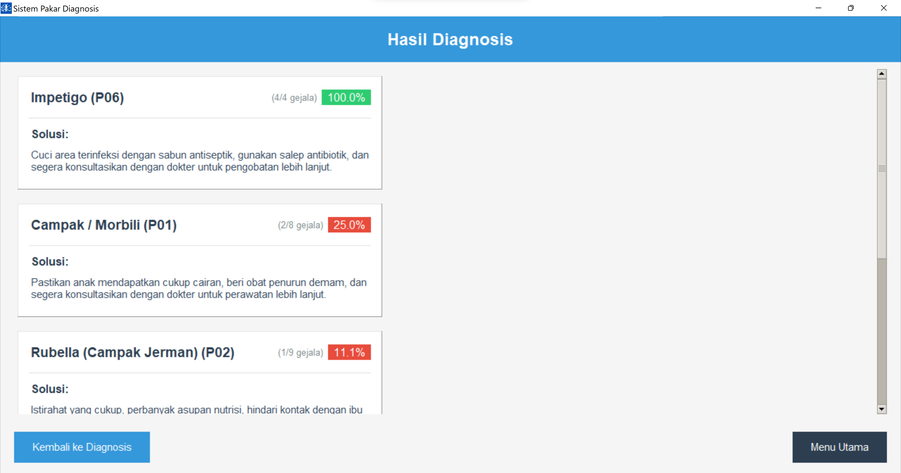

# 🧠 Expert System in Python  

This project implements an expert system using Python, leveraging a knowledge base in JSON format to perform diagnoses or provide recommendations based on predefined rules. The system is fully **customizable**, allowing users to modify symptoms, conditions, and even the system's name or title.  

## 📂 Project Structure  
```
📁 assets/                 # Folder for additional assets (images, models, etc.)
📄 expert_system_data.json # JSON file containing the expert system's knowledge base
🐍 SISTEM-PAKAR.py         # Main source code to run the expert system
```

## ⚙️ Requirements  
Ensure you have the following dependencies installed before running the program:  

🐍 **Python**  
🖥️ **Tkinter**  

## 🚀 Usage  

1. Run the system:  
   ```sh
   python SISTEM-PAKAR.py
   ```
2. The system loads knowledge from `expert_system_data.json`.  
3. You can input symptoms, and the system will analyze them based on predefined rules.  
4. To customize the system (change symptoms, diseases, or system name), use the **Edit System Data** menu.  
5. Save the updated knowledge base, and the system will use the new data.  

## 📝 Features  

- **Customizable System**: Modify symptoms, diseases, and system name easily.  
- **Rule-Based Decision Making**: Uses a JSON-based knowledge base.  
- **User-Friendly Interface**: Interactive menus for editing and diagnosing.  
- **Expandable Knowledge Base**: Easily add new rules and data.


Here’s the updated README with customization details and a section for the program preview:  

---

# 🧠 Expert System in Python  

This project implements a **customizable expert system** using Python, allowing users to define symptoms, conditions (e.g., diseases), and even modify the system's name or title according to their needs. The system uses a knowledge base stored in JSON format to provide rule-based diagnoses or recommendations.  

## 📂 Project Structure  
```
📁 assets/                 # Folder for additional assets (images, models, etc.)
📄 expert_system_data.json # JSON file containing the expert system's knowledge base
🐍 SISTEM-PAKAR.py         # Main source code to run the expert system
```

## ⚙️ Key Features  
- **Fully Customizable**: Modify symptoms, conditions (e.g., diseases), and even the system’s title.  
- **Rule-Based Decision Making**: Uses JSON-based data for expert reasoning.  
- **Python Implementation**: A lightweight and flexible system.  
- **Expandable Knowledge Base**: Easily add more rules by editing the JSON file.  

## 🚀 Getting Started  

### Prerequisites  
Ensure you have Python installed on your system.  

### Installation  
1. Clone this repository:  
   ```sh
   git clone https://github.com/yourusername/expert-system.git
   cd expert-system
   ```
2. Install dependencies (if any):  
   ```sh
   pip install -r requirements.txt
   ```
3. Run the system:  
   ```sh
   python SISTEM-PAKAR.py
   ```

## 🔧 Customization Guide  
This system is designed to be fully **modifiable**. You can:  
✅ **Add or Edit Symptoms** in `expert_system_data.json`  
✅ **Modify Diseases/Conditions** to fit your needs  
✅ **Change the System’s Name** by editing the source code in `SISTEM-PAKAR.py`  

## 🖥️ Program Preview  





